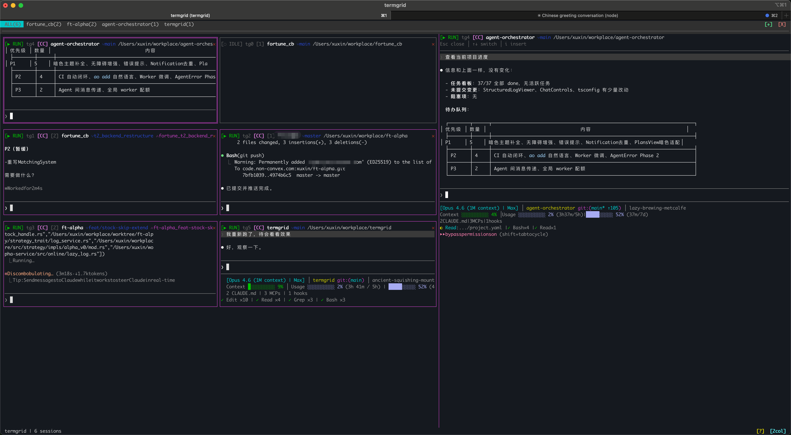

# termgrid

[](https://crates.io/crates/termgrid)
[](https://github.com/eddiexux/termgrid/actions)
[](LICENSE-MIT)

一个带 Git 上下文感知的终端多窗口管理器，使用 Rust 构建。

在一个仪表盘中管理多个终端会话。每个窗格自动检测 Git 项目、分支和 worktree —— 让你一眼看到每个终端在哪个项目、哪个分支下工作。

[English](README.md)



## 功能特性

- **多终端网格** —— 1/2/3 列布局，小窗格实时预览终端输出
- **Git 上下文感知** —— 自动检测项目名、分支、worktree
- **项目分组** —— Tab 栏按 Git 项目自动分组，点击切换过滤
- **详情面板** —— 选中窗格后右侧展示完整终端输出，支持颜色
- **纯鼠标交互** —— 所有操作通过工具栏按钮完成，无需记忆快捷键，无模式切换
- **滚动锁定** —— 详情面板往回翻时位置锁定，新输出不会把你拽回底部
- **会话持久化** —— 退出时自动保存布局和终端历史，重启后恢复
- **鼠标支持** —— 点击选中窗格，拖动选中文本（松手自动复制到剪贴板）
- **完整终端模拟** —— 基于 [vt100](https://crates.io/crates/vt100)，支持复杂 TUI 应用
- **中文支持** —— 正确处理全角字符宽度
- **日志系统** —— 调试日志写入 `~/.local/share/termgrid/termgrid.log`

## 安装

### Homebrew（macOS）

```bash
brew tap eddiexux/tap
brew install termgrid
```

> **注意：** 需要先在 GitHub 创建 `homebrew-tap` 仓库，并将 `packaging/homebrew/termgrid.rb`
> 发布到该仓库的 `Formula/termgrid.rb`。

### 从 crates.io 安装

```bash
cargo install termgrid
```

### 更新到最新版本

```bash
cargo install termgrid --force
```

### 从源码安装（开发版）

```bash
cargo install --git https://github.com/eddiexux/termgrid.git
```

### 本地构建

```bash
git clone https://github.com/eddiexux/termgrid.git
cd termgrid
cargo build --release
# 二进制文件位于 target/release/termgrid
```

## 使用

```bash
termgrid                # 启动（自动恢复上次会话，或空白仪表盘）
termgrid ~/projects     # 在指定目录打开一个终端窗格
termgrid --fresh        # 忽略保存的会话，全新启动
```

### 纯鼠标交互

所有操作通过工具栏按钮完成，无需记忆快捷键。点击窗格即可选中，键盘输入直接发送到对应终端。

#### 顶栏（Tab 栏）

| 按钮 | 功能 |
|------|------|
| Tab 标签 | 点击切换项目过滤 |
| `[+]` | 新建窗格 |
| `[X]` | 退出程序 |

#### 底栏（状态栏）

| 按钮 | 功能 |
|------|------|
| `[?]` | 显示帮助 |
| `[×]` | 关闭选中窗格 |
| `[Ncol]` | 循环切换列数（1 → 2 → 3 → 1） |

#### 鼠标操作

- **点击**小窗格 → 选中，键盘输入直接发送到该终端
- **在详情面板中拖动** → 选中文本（蓝色高亮），松手自动复制到剪贴板
- **滚轮** → 滚动网格 / 详情面板历史

## 配置

可选配置文件 `~/.config/termgrid/config.toml`：

```toml
[layout]
default_columns = 2          # 默认列数 1-3
detail_panel_width = 45      # 详情面板宽度百分比

[scan]
root_dirs = ["~/workplace"]  # 项目扫描根目录
scan_depth = 2               # 扫描深度

[terminal]
shell = "/bin/zsh"           # 默认 shell
cwd_poll_interval = 2        # CWD 检测轮询间隔（秒）
```

## 平台支持

- **macOS** —— 完整支持（通过 `proc_pidinfo` 跟踪 CWD）
- **Linux** —— 计划中（通过 `/proc` 跟踪 CWD）
- **Windows** —— 暂无计划

## 架构

```
termgrid
├── App          —— 事件循环 + 鼠标驱动的状态管理
├── EventLoop    —— tokio 驱动，多路复用 PTY 输出 + 用户输入 + 定时器
├── TileManager  —— 窗格生命周期、选中、网格导航
│   └── Tile     —— PTY 进程 + vt100 终端模拟器 + Git 上下文
├── GitDetector  —— CWD 变化 → git2 仓库检测（带防抖）
├── TabBar       —— 从窗格的 Git 上下文动态聚合项目分组
├── Layout       —— 多列网格 + 详情面板布局计算
└── UI           —— ratatui 渲染组件（窗格卡片、详情面板、Tab 栏、弹窗）
```

## 技术栈

| 组件 | Crate |
|------|-------|
| TUI 框架 | [ratatui](https://ratatui.rs/) + [crossterm](https://crates.io/crates/crossterm) |
| 终端模拟 | [vt100](https://crates.io/crates/vt100) |
| PTY 管理 | [portable-pty](https://crates.io/crates/portable-pty) |
| Git 检测 | [git2](https://crates.io/crates/git2) |
| 异步运行时 | [tokio](https://tokio.rs/) |

## 许可证

本项目采用以下任一许可证：

- Apache License 2.0（[LICENSE-APACHE](LICENSE-APACHE)）
- MIT License（[LICENSE-MIT](LICENSE-MIT)）

由使用者自行选择。

## 贡献

参见 [CONTRIBUTING.md](CONTRIBUTING.md)。
